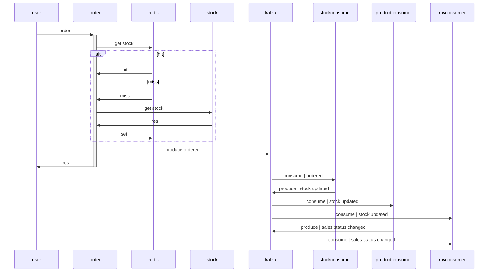

```mermaid
sequenceDiagram
    user ->>+ order: order
    order->>+redis: get stock
    alt hit
        redis->>order: hit
    else miss
        redis->>order: miss
        order->>stock: get stock
        stock->>order: res
        order->>redis: set
    end
    order->>+kafka: produce|ordered
    order->>-user: res
    kafka->>stockconsumer: consume | ordered
    stockconsumer->>kafka: produce | stock updated
    kafka->>productconsumer: consume | stock updated
    kafka->>mvconsumer: consume | stock updated
    productconsumer->>kafka: produce | sales status changed
    kafka->>mvconsumer: consume | sales status changed
```